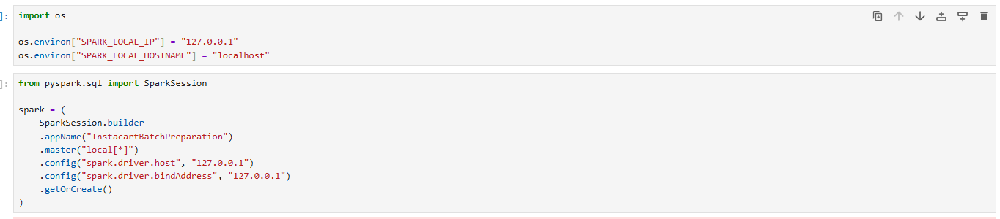

# Journal - September 4, 2026 - Instacart Pipeline

## Today in one sentence

* This week, I focused on planning and testing our Instacart data pipeline, improving my understanding of star schemas, using PySpark to get sample data from very large dataset, and becoming more comfortable with GitHub collaboration.

## What I learned

* I learned that the fact table should be defined by the business process and its grain. For our Instacart model, one row represents one product within one order.
* I practiced planning validations for each layer of the pipeline instead of checking only whether the tables were successfully created.
* I also learned more about using separate Git branches so that team members can work independently before merging their changes into `main`.

## Terms I am still learning

* **Grain** - what exactly one row represents in a table.
* **Deduplication** - identifying and removing repeated records while keeping the correct version.
* **Idempotency** - making sure rerunning a pipeline does not create duplicate or inconsistent data.

## What confused me

* I was initially unsure how to separate the test runs from the final full-data run without repeatedly changing or deleting tables.
* I also needed to clarify why the order-product table is the fact table even when the final analysis focuses on counting orders or products by different dimensions.
* I am still learning when a data-quality issue should cause a row to be dropped and when it should only be retained with a warning flag.

## One small next step

* [ ] Finalize the fact-table grain and write validation queries that confirm row counts, duplicate handling, and relationships with the dimension tables.

## Git checkpoint

* [x] I created or updated a file
* [x] I wrote a commit
* [x] I pushed my changes

## Decisions or assumptions

* Different metrics must be clearly defined. For example, `COUNT(DISTINCT order_id)` measures orders, while `SUM(quantity)` measures the total number of items purchased.
* Test data and final data should be kept separate so that pipeline testing does not interfere with the final tables.
* Team members should work on their own branches and merge their changes through pull requests instead of making all changes directly in `main`.

## Evidence from today

## Reflection (optional)

* **What felt difficult today?** Designing the overall pipeline structure and deciding how to handle testing, duplicates, and data-quality issues required more thought.
* **What do I want to understand better next time?** I want to become more confident in choosing the correct fact-table grain and connecting business questions to the appropriate metrics and dimensions.

## Mood or meme (optional)
TT TT

**_Note: This is for Week1: 08/29/2026-09/04/2026_**
